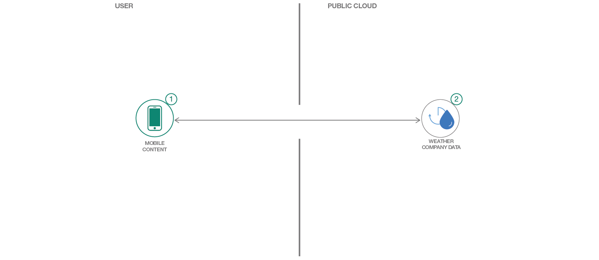
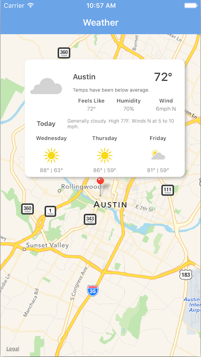

[](https://bluemix.net)
[](https://developer.apple.com/swift/)

# Create an iOS weather application in Swift

> We have a similar pattern available for [Android](https://github.com/IBM/weather-forecasting-android), as well!

In this code pattern, you will create an iOS weather forecasting app using Apple Maps and the Weather Company Data service. Use this service to consume current conditions or hourly, daily, and intraday forecasts based on Apple Maps geolocation coordinations of your user's device. Use this pattern to solve real business problems where weather has a significant impact on the outcome.

When you have completed this code pattern, you will understand how to:

* Provision and integrate the Weather Company Data service
* Use Geolocation information integrated with Apple Maps
* Connect to additional IBM Cloud services



## Requirements

* iOS 8.0+
* Xcode 8.0
* Swift 3.0

## IBM Cloud Mobile services and Weather Dependency Management

This starter uses the IBM Cloud Mobile services SDKs to use the functionality of the Mobile Analytics, Push Notifications, and Weather services.

The IBM Cloud Mobile services SDK uses [CocoaPods](https://cocoapods.org/) to manage and configure dependencies. To use our latest SDKs, you need version 1.1.0.rc.2.

Install CocoaPods using the following command:

```bash
$ sudo gem install cocoapods --pre
```

If the CocoaPods repository is not configured, run the following command:

```bash
$ pod setup
```

For this starter, a pre-configured `Podfile` is included in this repository. To download and install the required dependencies, run the following command in this repository:

```bash
$ pod install
```
Open the Xcode workspace: `{APP_Name}.xcworkspace`. Continue to open the `.xcworkspace` file as it contains all the dependencies and configurations.

If you run into any issues during the pod install, it is recommended to run a pod update by using the following commands:

```bash
$ pod update
$ pod install
```

## Weather Credential Management

Once the dependencies have been built and configured for the IBM Cloud Mobile service SDKs, configure the Weather credentials for the application. If you have not already created the Weather service on IBM Cloud, go to the [IBM Cloud Catalog](https://console.ng.bluemix.net/catalog/) and create a [Weather](https://console.ng.bluemix.net/catalog/services/weather-company-data/) service instance.

A `WeatherCredentials.plist` configuration file is included in the Xcode project that includes credential configurations for Weather service:

| Key              | Value           |
| :-------------:  |:-------------:|
| host          | twcservice.mybluemix.net |
| username      | 6123kljda-e486-4bcf-89ed-063050df742f |
| password      | zlkj23lkf |

Find the credentials for your `WeatherCredentials.plist` file by clicking the **Service Credentials** button:


## Run

Click **Product > Run** to start the app in Xcode.



The application allows you determine the forecast of any location using your Weather instance on IBM Cloud. Long click to view the forecast.

## License

[Apache 2.0](LICENSE)
