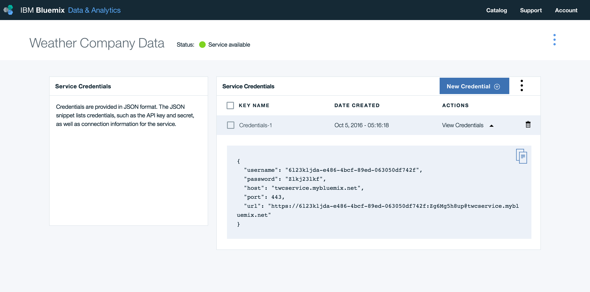

[](https://bluemix.net)
[](https://developer.apple.com/swift/)

# Create an iOS weather application in Swift

The Bluemix Mobile Starter for Weather showcases getting a forecast using the coordinates from Apple Maps and gives you integration points for each of the Bluemix Mobile services.

## Requirements

* iOS 8.0+
* Xcode 8.0
* Swift 3.0

## Configuration

* [Bluemix Mobile services and Weather Dependency Mangagement](#bluemix-mobile-services-and-weather-dependency-management)
* [Weather Credential Management](#weather-credential-management)

## Bluemix Mobile services and Weather Dependency Management

This starter uses the Bluemix Mobile services SDKs to use the functionality of the Mobile Analytics, Push Notifications, and Weather services.

The Bluemix Mobile services SDK uses [CocoaPods](https://cocoapods.org/) to manage and configure dependencies. To use our latest SDKs, you need version 1.1.0.rc.2.

Install CocoaPods using the following command:

```bash
$ sudo gem install cocoapods --pre
```

If the CocoaPods repository is not configured, run the following command:

```bash
$ pod setup
```

For this starter, a pre-configured `Podfile` is included in this repository. To download and install the required dependencies, run the following command in this repository:

```bash
$ pod install
```
Open the Xcode workspace: `{APP_Name}.xcworkspace`. Continue to open the `.xcworkspace` file as it contains all the dependencies and configurations.

If you run into any issues during the pod install, it is recommended to run a pod update by using the following commands:

```bash
$ pod update
$ pod install
```

> [View configuration](#configuration)

## Weather Credential Management

Once the dependencies have been built and configured for the Bluemix Mobile service SDKs, configure the Weather credentials for the application. If you have not already created the Weather service on Bluemix, go to the [Bluemix Catalog](https://new-console.ng.bluemix.net/catalog/) and create a [Weather](https://new-console.ng.bluemix.net/catalog/services/weather-company-data/) service instance.

A `WeatherCredentials.plist` configuration file is included in the Xcode project that includes credential configurations for Weather service:

| Key              | Value           |
| :-------------:  |:-------------:|
| host          | twcservice.mybluemix.net |
| username      | 6123kljda-e486-4bcf-89ed-063050df742f |
| password      | zlkj23lkf |

Find the credentials for your `WeatherCredentials.plist` file by clicking the **Service Credentials** button:



> [View configuration](#configuration)

## Run

Click **Product > Run** to start the app in Xcode.


The application allows you determine the forecast of any location using your Weather instance on Bluemix. Long click to view the forecast.

## License

[Apache 2.0](LICENSE)
